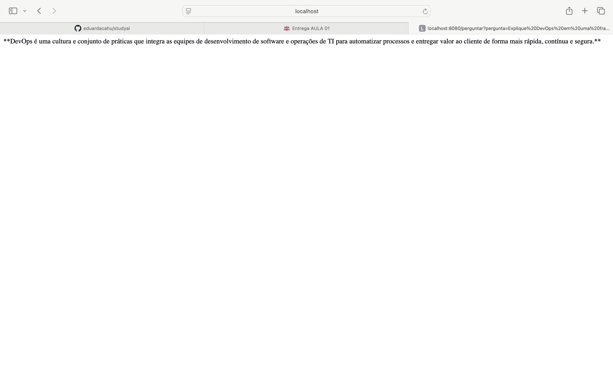

[](https://github.com/eduardacahu/studyai/actions/workflows/ci.yml)
# StudyAI

O **StudyAI** é uma API desenvolvida em Java com Spring Boot que utiliza Inteligência Artificial Generativa para responder perguntas e auxiliar nos estudos.

O projeto foi desenvolvido como parte do desafio de **DevOps e Inteligência Artificial**, aplicando conceitos de desenvolvimento de APIs, versionamento de código com Git/GitHub e integração com IA generativa.

## Tecnologias utilizadas

- Java
- Spring Boot
- Maven
- Git
- GitHub
- Gemini API (Google)
- REST API

## Funcionalidades

A aplicação possui dois endpoints principais:

### 1. Verificação da API

```http
GET /hello
```

Exemplo de resposta:

```text
Olá! O StudyAI está funcionando!
```

### 2. Pergunta para Inteligência Artificial

```http
GET /perguntar?pergunta=SuaPergunta
```

Exemplo:

```http
GET /perguntar?pergunta=Explique DevOps em uma frase
```

A pergunta é enviada para a API do Gemini e a resposta gerada pela Inteligência Artificial é retornada pela aplicação.

## Configuração da API

Por segurança, a chave da API Gemini não é armazenada diretamente no código-fonte.

A aplicação utiliza a variável de ambiente:

```text
GEMINI_API_KEY
```

## Executando o projeto

Com a variável de ambiente configurada, execute:

```bash
./mvnw spring-boot:run
```

A aplicação ficará disponível em:

```text
http://localhost:8080
```

## Exemplos de acesso

Teste da aplicação:

```text
http://localhost:8080/hello
```

Pergunta para a IA:

```text
http://localhost:8080/perguntar?pergunta=Ola
```
## Evidência da integração com IA

A imagem abaixo demonstra uma resposta gerada pela Gemini através da aplicação StudyAI.


## Integração Contínua

O projeto utiliza **GitHub Actions** para executar automaticamente o processo de build e testes a cada novo push ou pull request realizado na branch `main`.

O workflow de CI realiza:

- Checkout do código-fonte;
- Configuração do Java 25;
- Configuração do ambiente Maven;
- Execução automática do build e dos testes com `./mvnw clean verify`.

Essa automação permite verificar continuamente se a aplicação permanece compilando e funcionando corretamente após alterações no código.
## Objetivo do projeto

O objetivo do StudyAI é demonstrar, de forma prática, a integração entre uma aplicação Spring Boot e uma ferramenta de Inteligência Artificial Generativa, utilizando boas práticas de versionamento e proteção de credenciais.

## Autora

Eduarda Cahu